# TelemetryHub - Architecture Diagrams

**Purpose**: Visual reference for Day 3 & Day 3 Extended work  
**For**: Interview preparation, mental models, whiteboard sketching  
**Date**: December 28, 2025

---

## 🏗️ System Architecture Overview


**Key Points for Interview**:
- **Ingestion**: REST API → Protobuf serialization (10x faster than JSON)
- **Queue**: Redis for decoupling (50k ops/sec)
- **Processing**: Priority-based task scheduling (O(log n))
- **Testing**: Multi-layer (unit → integration → load)

---

## 🧪 Multi-Layer Testing Strategy (Day 3 Extended)

```mermaid
graph TB
    subgraph "Layer 1: Unit Tests - Fast Feedback"
        GT[GoogleTest<br/>Existing Tests<br/>36/38 passing]
        C2[Catch2<br/>New BDD Tests<br/>10 scenarios]
        
        GT -->|Test| PA[ProtoAdapter<br/>Serialization]
        GT -->|Test| RC[RedisClient<br/>RAII Wrapper]
        C2 -->|Test BDD| TQ[TaskQueue<br/>Priority Queue]
        
        GT -.->|"~100ms for 1000 tests"| FAST1[⚡ Fast]
        C2 -.->|"30% faster compile"| FAST1
    end
    
    subgraph "Layer 2: Integration Tests - Pipeline Validation"
        PY[pytest<br/>8 Integration Tests]
        FIX[Fixtures<br/>redis_client<br/>clean_redis]
        PARAM[Parametrized<br/>10 scenarios<br/>1 function]
        
        PY -->|Uses| FIX
        PY -->|Uses| PARAM
        PY -->|Test E2E| PIPELINE[Gateway → Redis<br/>→ Processor]
        
        PY -.->|"~10s for 50 tests"| MED[⚡ Moderate]
    end
    
    subgraph "Layer 3: Load Tests - Performance SLA"
        K6[k6 JavaScript<br/>2 Load Scripts]
        VU[Virtual Users<br/>5,000 concurrent]
        THRESH[Thresholds<br/>p95 < 200ms<br/>errors < 1%]
        
        K6 -->|Simulates| VU
        K6 -->|Validates| THRESH
        K6 -->|Sends Metrics| INFLUX[(InfluxDB)]
        INFLUX -->|Visualize| GRAF[Grafana<br/>Dashboards]
        
        K6 -.->|"~2 min per test"| SLOW[⚡ Slow but thorough]
    end
    
    FAST1 -->|"Build GREEN"| MED
    MED -->|"Pipeline Works"| SLOW
    SLOW -->|"SLA Validated"| PROD[✅ Production Ready]
    
    style GT fill:#4CAF50,stroke:#2E7D32,stroke-width:2px,color:#fff
    style C2 fill:#2196F3,stroke:#1565C0,stroke-width:2px,color:#fff
    style PY fill:#FFC107,stroke:#F57C00,stroke-width:2px,color:#000
    style K6 fill:#9C27B0,stroke:#6A1B9A,stroke-width:2px,color:#fff
    style GRAF fill:#FF5722,stroke:#D84315,stroke-width:2px,color:#fff
    style PROD fill:#00C853,stroke:#00872F,stroke-width:3px,color:#fff
```



**Interview Answer**: "I use a three-layer testing pyramid: fast unit tests (GoogleTest + Catch2), moderate integration tests (pytest), and thorough load tests (k6). Each layer validates different aspects - logic, API, and performance."

---

## 🔄 Data Flow: Telemetry Ingestion Pipeline


**Interview Talking Point**: "The pipeline is fully asynchronous - gateway responds immediately after queuing to Redis. The processor pulls tasks by priority, ensuring alerts (HIGH) are processed before analytics (LOW)."

---

## 🏛️ TaskQueue Internal Architecture (Day 3)

```mermaid
graph TB
    subgraph "TaskQueue Class - Priority Scheduler"
        API[Public API<br/>enqueue/dequeue/peek]
        
        subgraph "Thread Safety"
            MTX[std::mutex<br/>queue_mutex_]
            CV_EMPTY[std::condition_variable<br/>not_empty_]
            CV_FULL[std::condition_variable<br/>not_full_]
        end
        
        subgraph "Priority Queue"
            HEAP[std::priority_queue<br/>Binary Heap<br/>O(log n)]
            COMP[Custom Comparator<br/>1. Priority (HIGH>MED>LOW)<br/>2. Timestamp (FIFO)]
        end
        
        subgraph "Task Structure"
            T_ID[id: string]
            T_PRI[priority: enum<br/>HIGH/MEDIUM/LOW]
            T_TIME[created_at:<br/>time_point]
            T_PAY[payload: JSON]
        end
        
        API --> MTX
        MTX --> HEAP
        HEAP --> COMP
        HEAP --> T_ID
        HEAP --> T_PRI
        HEAP --> T_TIME
        HEAP --> T_PAY
        
        API --> CV_EMPTY
        API --> CV_FULL
    end
    
    subgraph "Operations"
        ENQ[enqueue(task)<br/>1. Lock mutex<br/>2. Wait if full<br/>3. Push to heap<br/>4. Notify not_empty]
        DEQ[dequeue()<br/>1. Lock mutex<br/>2. Wait if empty<br/>3. Pop from heap<br/>4. Notify not_full]
        PEEK[peek()<br/>1. Lock mutex<br/>2. Return top<br/>3. Don't remove]
    end
    
    API --> ENQ
    API --> DEQ
    API --> PEEK
    
    subgraph "Testing Coverage - Day 3 Extended"
        GT_TEST[GoogleTest<br/>20+ scenarios]
        C2_TEST[Catch2<br/>10 BDD scenarios<br/>SCENARIO/GIVEN/WHEN/THEN]
        
        GT_TEST -.->|Test| ENQ
        GT_TEST -.->|Test| DEQ
        C2_TEST -.->|Test BDD| COMP
        C2_TEST -.->|Test Concurrency| MTX
    end
    
    style API fill:#4CAF50,stroke:#2E7D32,stroke-width:3px,color:#fff
    style HEAP fill:#2196F3,stroke:#1565C0,stroke-width:2px,color:#fff
    style MTX fill:#FF5722,stroke:#D84315,stroke-width:2px,color:#fff
    style C2_TEST fill:#9C27B0,stroke:#6A1B9A,stroke-width:2px,color:#fff
```

**Interview Explanation**: "I implemented a thread-safe priority queue using a binary heap with O(log n) operations. It uses a custom comparator that prioritizes by enum value first (HIGH=0, MEDIUM=1, LOW=2), then by timestamp for FIFO within the same priority. Two condition variables handle blocking when full or empty."

---

## 🧩 Testing Framework Integration (Day 3 Extended)


**Interview Explanation**: "I integrated 4 testing frameworks via CMake and Docker Compose. Catch2 is auto-fetched via FetchContent, pytest uses fixtures for setup/teardown, and k6 sends metrics to InfluxDB for Grafana visualization. The pipeline runs unit → integration → load tests sequentially."

---

## 📊 Testing Workflow: CI/CD Pipeline

```mermaid
flowchart TB
    START([Git Push]) --> BUILD[CMake Configure<br/>-DBUILD_CATCH2_TESTS=ON]
    
    BUILD --> COMPILE[Compile C++ Code<br/>Release Mode]
    
    COMPILE --> UNIT{Unit Tests}
    
    subgraph "Unit Testing"
        UNIT -->|GoogleTest| GT_RUN[Run 36 existing tests]
        UNIT -->|Catch2| C2_RUN[Run 10 BDD scenarios]
        
        GT_RUN --> GT_PASS{Pass?}
        C2_RUN --> C2_PASS{Pass?}
        
        GT_PASS -->|No| FAIL1[❌ Build Failed]
        C2_PASS -->|No| FAIL1
        
        GT_PASS -->|Yes| UNIT_OK
        C2_PASS -->|Yes| UNIT_OK
    end
    
    UNIT_OK[✅ Unit Tests Pass] --> DOCKER[Start Docker Services<br/>Redis + InfluxDB + Grafana]
    
    DOCKER --> INT{Integration Tests}
    
    subgraph "Integration Testing"
        INT -->|pytest| PY_RUN[Run 8 pytest tests<br/>Gateway → Redis]
        
        PY_RUN --> PY_PASS{Pass?}
        PY_PASS -->|No| FAIL2[❌ Integration Failed]
        PY_PASS -->|Yes| INT_OK
    end
    
    INT_OK[✅ Integration Pass] --> LOAD{Load Tests}
    
    subgraph "Load Testing"
        LOAD -->|k6| K6_RUN[Simulate 5k devices<br/>Ramp: 100→1k→5k VUs]
        
        K6_RUN --> K6_THRESH{Thresholds?}
        
        K6_THRESH -->|p95 < 200ms?| THRESH_OK
        K6_THRESH -->|errors < 1%?| THRESH_OK
        K6_THRESH -->|Failed| FAIL3[❌ SLA Not Met]
        
        THRESH_OK[✅ All Thresholds Pass] --> METRICS[Send Metrics to InfluxDB]
        METRICS --> GRAF_VIZ[Visualize in Grafana]
    end
    
    GRAF_VIZ --> DEPLOY{Deploy?}
    
    DEPLOY -->|Manual Approval| PROD[🚀 Production Deploy]
    DEPLOY -->|Auto| STAGING[🔧 Staging Deploy]
    
    FAIL1 --> NOTIFY[📧 Notify Team]
    FAIL2 --> NOTIFY
    FAIL3 --> NOTIFY
    
    style START fill:#4CAF50,stroke:#2E7D32,stroke-width:2px,color:#fff
    style UNIT_OK fill:#2196F3,stroke:#1565C0,stroke-width:2px,color:#fff
    style INT_OK fill:#FFC107,stroke:#F57C00,stroke-width:2px,color:#000
    style THRESH_OK fill:#9C27B0,stroke:#6A1B9A,stroke-width:2px,color:#fff
    style PROD fill:#00C853,stroke:#00872F,stroke-width:3px,color:#fff
    style FAIL1 fill:#F44336,stroke:#C62828,stroke-width:2px,color:#fff
    style FAIL2 fill:#F44336,stroke:#C62828,stroke-width:2px,color:#fff
    style FAIL3 fill:#F44336,stroke:#C62828,stroke-width:2px,color:#fff
```



**CI/CD Stages**:
1. **Build** (CMake + compile)
2. **Unit Tests** (GoogleTest + Catch2) - ~100ms
3. **Integration Tests** (pytest) - ~10s
4. **Load Tests** (k6) - ~2 min
5. **Deploy** (staging/prod)

---

## 🎯 Interview Cheat Sheet: Component Comparison

```mermaid
graph TB
    subgraph "Testing Framework Selection"
        QUESTION{Need to test...?}
        
        QUESTION -->|Individual<br/>functions/classes| UNIT[Unit Tests]
        QUESTION -->|API endpoints<br/>E2E pipeline| INT[Integration Tests]
        QUESTION -->|Performance<br/>under load| LOAD[Load Tests]
        
        UNIT -->|C++ code?| CPP{Language?}
        CPP -->|Existing tests| GT[✅ GoogleTest<br/>Keep existing]
        CPP -->|New tests| C2[✅ Catch2<br/>BDD style]
        
        INT -->|Backend API?| PY[✅ pytest<br/>Fixtures + Parametrize]
        INT -->|Acceptance?| ROBOT[⚠️ ROBOT Framework<br/>Only if stakeholders<br/>write tests]
        
        LOAD -->|Modern,<br/>cloud-native?| K6[✅ k6<br/>JavaScript DSL<br/>Grafana integration]
        LOAD -->|Legacy,<br/>GUI-based?| JMETER[⚠️ JMeter<br/>Harder to version<br/>control]
    end
    
    subgraph "Decision Matrix"
        GT -.->|Pros| GT_PROS[✓ Industry standard<br/>✓ Mature ecosystem<br/>✓ 36 existing tests]
        GT -.->|Cons| GT_CONS[✗ Verbose syntax<br/>✗ Slower compilation]
        
        C2 -.->|Pros| C2_PROS[✓ BDD syntax<br/>✓ 30% faster compile<br/>✓ Self-documenting]
        C2 -.->|Cons| C2_CONS[✗ Growing adoption<br/>✗ Learning curve]
        
        PY -.->|Pros| PY_PROS[✓ Excellent fixtures<br/>✓ Parametrized tests<br/>✓ Great debugging]
        PY -.->|Cons| PY_CONS[✗ Requires Python<br/>✗ Not for C++ unit tests]
        
        K6 -.->|Pros| K6_PROS[✓ Cloud-native<br/>✓ Built-in p95/p99<br/>✓ Grafana integration]
        K6 -.->|Cons| K6_CONS[✗ JavaScript DSL<br/>✗ Learning curve]
    end
    
    style GT fill:#4CAF50,stroke:#2E7D32,stroke-width:2px,color:#fff
    style C2 fill:#2196F3,stroke:#1565C0,stroke-width:2px,color:#fff
    style PY fill:#FFC107,stroke:#F57C00,stroke-width:2px,color:#000
    style K6 fill:#9C27B0,stroke:#6A1B9A,stroke-width:2px,color:#fff
```



**Interview Answer Template**:
> "I chose [framework] because [pros]. The main tradeoff is [cons], but it's worth it because [business value]. For example, Catch2's BDD syntax makes tests self-documenting, which helps with code reviews and onboarding."

---

## 🔑 Key Metrics Mind Map

```mermaid
mindmap
  root((TelemetryHub<br/>Performance))
    Serialization
      Protobuf: 408k ops/sec
        10x faster than JSON
        3x smaller (30 bytes vs 90)
      Use Case: Device telemetry
    Queue
      Redis: 50k SET/sec
        60k GET/sec
        Sub-millisecond latency
      Use Case: Decoupling services
    TaskQueue
      O(log n) enqueue/dequeue
        Binary heap
        ~500k ops/sec estimated
      Use Case: Priority scheduling
    Testing
      Unit: ~100ms for 1000 tests
        GoogleTest + Catch2
      Integration: ~10s for 50 tests
        pytest with fixtures
      Load: ~2 min for 5k devices
        k6 with Grafana
    SLA Targets
      Throughput: 50k events/sec
      p95 Latency: < 200ms
      p99 Latency: < 500ms
      Error Rate: < 1%
```

**Memorization Tip**: Use the acronym **"SQTTP"** - Serialization, Queue, TaskQueue, Testing, Performance

---

## 📚 Usage Examples

### View Diagrams in VS Code

1. Install Mermaid Preview extension (if not installed)
2. Open this file: `docs/ARCHITECTURE_DIAGRAMS.md`
3. Right-click → "Open Preview"
4. View interactive diagrams

### Export for Presentations

```bash
# Using mermaid-cli (mmdc)
npm install -g @mermaid-js/mermaid-cli

# Export to PNG
mmdc -i docs/ARCHITECTURE_DIAGRAMS.md -o diagrams.png

# Export to SVG (better quality)
mmdc -i docs/ARCHITECTURE_DIAGRAMS.md -o diagrams.svg
```

### Sketch on Whiteboard (Interview)

**Tips**:
1. Start with high-level architecture (System Overview)
2. Zoom into specific component (e.g., TaskQueue)
3. Explain data flow with sequence diagram
4. Show testing strategy as layers

**Practice**: Sketch each diagram from memory in 2-3 minutes

---

## 🎓 Interview Strategy

### Diagram Selection by Question Type

| Question Type | Use This Diagram | Why |
|---------------|------------------|-----|
| "Describe the system" | System Architecture Overview | Shows full stack |
| "How do you test?" | Multi-Layer Testing Strategy | Shows maturity |
| "Explain data flow" | Data Flow Sequence | Shows async design |
| "Deep dive TaskQueue" | TaskQueue Internal | Shows C++ expertise |
| "CI/CD process?" | Testing Workflow | Shows DevOps knowledge |

### Whiteboard Tips

1. **Start simple**: Box-and-arrow at first
2. **Add details**: Annotate with metrics (408k ops/sec)
3. **Show tradeoffs**: "Redis for speed, disk for persistence"
4. **Color code**: Use different colors for different layers
5. **Label everything**: No ambiguous boxes

### Talking While Drawing

> "Let me sketch the architecture... [draw boxes]  
> We have three main layers: ingestion, queue, and processing. [draw arrows]  
> The interesting part is the priority scheduler here [point to TaskQueue]...  
> It uses a binary heap for O(log n) operations. [add annotation]  
> We validate this with three testing layers [draw test boxes]..."

---

**✅ All diagrams are mermaid-based** - can be viewed in VS Code, GitHub, or exported to images!

**🎯 Next Steps**:
1. Preview diagrams: Right-click → "Mermaid: Preview"
2. Memorize key flows (use mind map)
3. Practice sketching on paper
4. Use in interview responses

**💡 Reminder**: Set up Grafana dashboards in Day 4!
