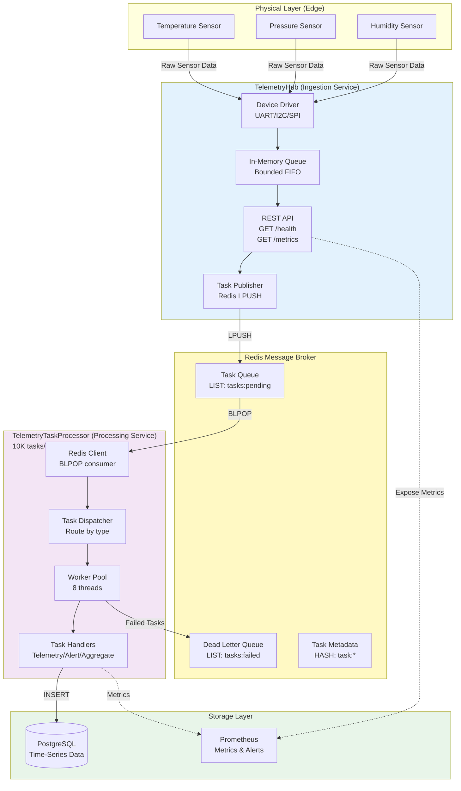
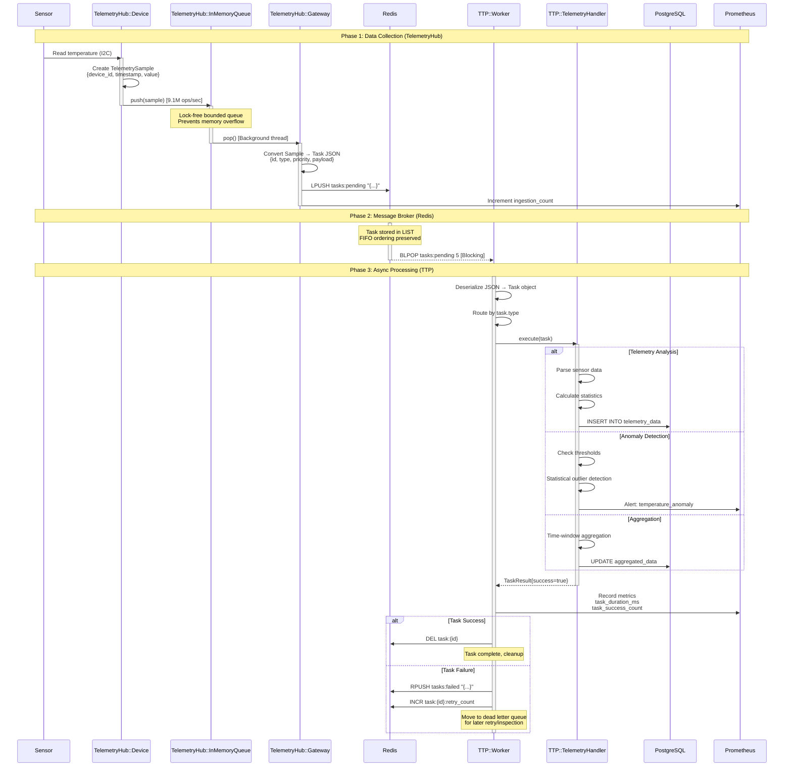
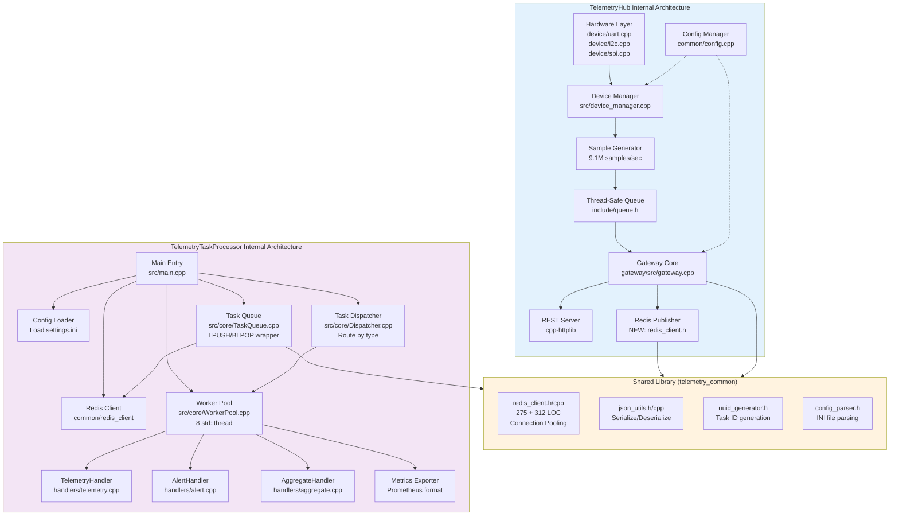
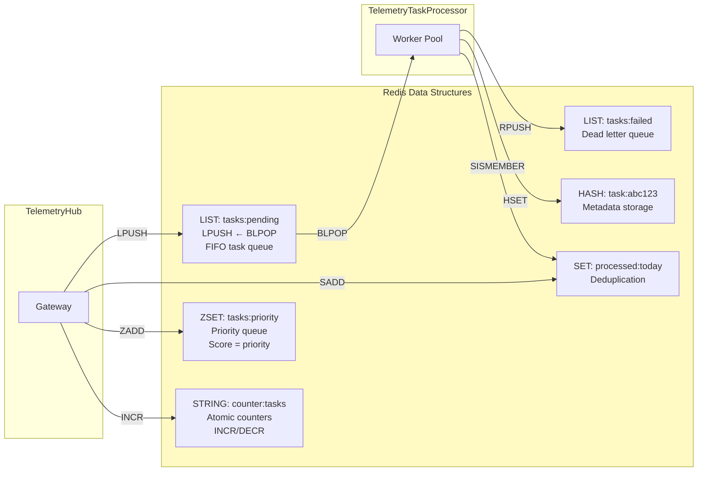
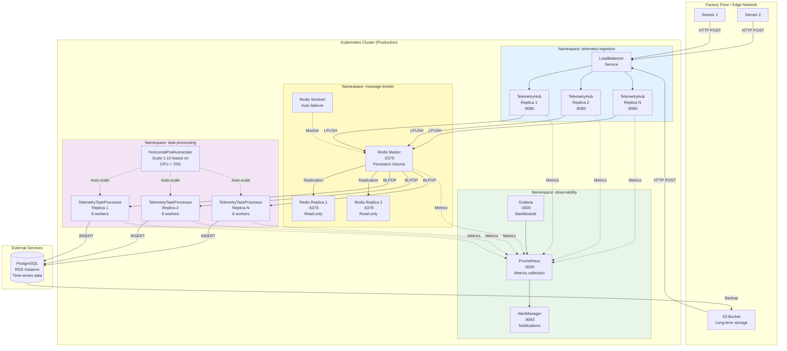
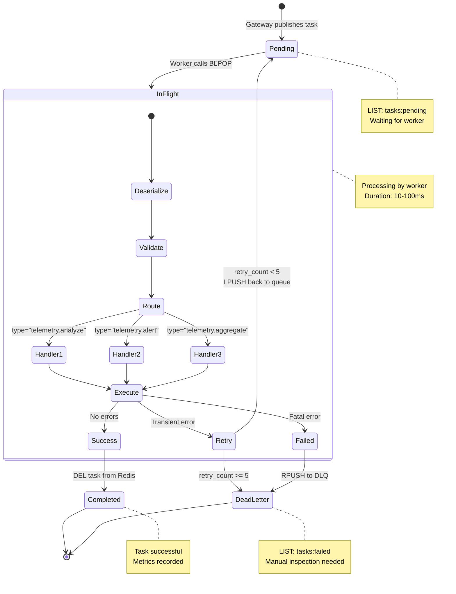

# Telemetry Platform - Complete Integration Architecture
**Day 2 Documentation - Visual Mental Model**

> **Interview Talking Points Throughout This Document:**
> - Systems design: End-to-end data flow from sensors to storage
> - Microservices architecture: Decoupled services communicating via Redis
> - Message broker pattern: Redis as central communication hub
> - Async processing: Worker pool consuming tasks from queue
> - Scalability: Independent horizontal scaling of ingestion vs processing

---

## 1. System Overview - 10,000 Foot View



**Interview Points:**
- **Decoupling:** TelemetryHub and TelemetryTaskProcessor are completely independent (can deploy/scale separately)
- **Resilience:** Redis provides buffering - if TTP goes down, tasks accumulate in queue without data loss
- **Scalability:** Add more TTP instances to increase processing throughput (horizontal scaling)

---

## 2. Detailed Data Flow - Task Lifecycle



**Interview Points:**
- **At-least-once delivery:** Task stays in Redis until explicitly deleted after success
- **Error handling:** Failed tasks move to DLQ (dead letter queue) with retry count
- **Observability:** Metrics at every stage (ingestion, processing, latency)
- **Blocking pop (BLPOP):** More efficient than polling - worker sleeps until task available

---

## 3. Component Architecture - Internal Details



**Interview Points:**
- **Shared library benefits:** Code reuse (redis_client, json_utils, uuid_generator) eliminates duplication
- **Monorepo advantage:** Atomic commits across services - change redis_client API, update both services in one commit
- **Independent builds:** Can build TelemetryHub without TelemetryTaskProcessor (CMake options)
- **SOLID principles:** Each component has single responsibility (device, queue, gateway, worker, handler)

---

## 4. Redis Integration Details



**Interview Points:**
- **LIST for FIFO queue:** O(1) push/pop, supports blocking operations (BLPOP)
- **ZSET for priority:** Score-based ordering, useful for task prioritization
- **SET for deduplication:** O(1) membership check, prevents duplicate processing
- **HASH for metadata:** Store task state (retries, timestamps, errors)
- **Atomic operations:** INCR/DECR for counters (thread-safe without locks)

---

## 5. Deployment Architecture - Production



**Interview Points:**
- **Horizontal scaling:** TelemetryHub and TTP scale independently based on load
- **Redis HA:** Master-replica setup with Sentinel for automatic failover
- **Kubernetes benefits:** Auto-scaling (HPA), health checks, rolling updates
- **Observability:** Prometheus scrapes metrics from all components
- **Persistent storage:** Redis uses PersistentVolume for task durability

---

## 6. Task Processing Flow - Worker Pool Details



**Interview Points:**
- **State transitions:** Clear task lifecycle from pending → in-flight → completed/failed
- **Retry logic:** Exponential backoff for transient errors (network timeouts, DB unavailable)
- **Dead letter queue:** Failed tasks preserved for debugging/analysis
- **Idempotency:** Handlers designed to be idempotent (safe to retry)

---

## 7. Scaling Strategy - Performance Optimization

```mermaid
flowchart TB
    subgraph Current["Current Setup<br/>10K tasks/sec"]
        TH_C[TelemetryHub × 1<br/>9.1M ops/sec ingestion]
        R_C[Redis × 1<br/>100K ops/sec capacity]
        TTP_C[TelemetryTaskProcessor × 1<br/>8 workers]
    end
    
    subgraph Scale1["Scale Option 1: Vertical<br/>30K tasks/sec"]
        TH_V[TelemetryHub × 1<br/>Same capacity]
        R_V[Redis × 1<br/>Enable pipelining<br/>Connection pool: 20]
        TTP_V[TelemetryTaskProcessor × 1<br/>16 workers<br/>Larger instance]
    end
    
    subgraph Scale2["Scale Option 2: Horizontal<br/>100K tasks/sec"]
        TH_H[TelemetryHub × 3<br/>Load balanced]
        R_H[Redis × 1<br/>With Sentinel HA]
        TTP_H[TelemetryTaskProcessor × 10<br/>8 workers each<br/>Kubernetes HPA]
    end
    
    subgraph Scale3["Scale Option 3: Distributed<br/>500K tasks/sec"]
        TH_D[TelemetryHub × 10<br/>Multi-region]
        R_D[Redis Cluster<br/>6 nodes (3 master, 3 replica)<br/>Sharded by hash slot]
        TTP_D[TelemetryTaskProcessor × 50<br/>Event-driven async I/O<br/>libuv / ASIO]
    end
    
    Current -.->|Add CPU/RAM| Scale1
    Scale1 -.->|Add replicas| Scale2
    Scale2 -.->|Architecture change| Scale3
    
    style Current fill:#e8f5e9
    style Scale1 fill:#fff9c4
    style Scale2 fill:#ffe0b2
    style Scale3 fill:#ffccbc
```

**Interview Points:**
- **Vertical first:** Easiest to implement, 3-5x improvement
- **Horizontal next:** More complex, 10x improvement, requires load balancing
- **Distributed last:** Architecture change, 50x improvement, needs Redis Cluster
- **Bottleneck analysis:** Profile to find constraint (Redis CPU? Worker threads? Network?)

---

## 8. Interview Preparation - Architecture Q&A

### Q1: "How do you handle backpressure if TTP is slower than TelemetryHub?"

**Answer:** 
Three-layer approach:
1. **Redis queue buffering:** Tasks accumulate in Redis LIST (memory permitting)
2. **TelemetryHub bounded queue:** Prevents unlimited memory growth (drops oldest if full)
3. **Monitoring & alerting:** Prometheus alert when `redis_list_length > 10000` → trigger auto-scaling

**Follow-up:** "What if Redis runs out of memory?"
- Redis maxmemory policy: `volatile-lru` (evict least-recently-used keys with TTL)
- Critical tasks use `ZADD` with high score (priority queue) instead of `LPUSH`
- Circuit breaker: TelemetryHub stops publishing if Redis unreachable

---

### Q2: "Why Redis over Kafka for message broker?"

**Answer:**
| Feature | Redis | Kafka | Decision |
|---------|-------|-------|----------|
| Latency | Sub-ms | 10-50ms | Redis wins for real-time |
| Throughput | 100K ops/sec | 1M+ msgs/sec | Redis sufficient for 10K tasks/sec |
| Persistence | AOF + RDB | Replicated log | Both adequate |
| Complexity | Single node | ZooKeeper + brokers | Redis simpler |
| Use case | Simple queue | Event streaming | Queue fits better |

**Conclusion:** Redis is right-sized for this project. Kafka adds unnecessary complexity unless requirements grow to 100K+ tasks/sec across multiple datacenters.

---

### Q3: "How do you ensure task durability (no data loss)?"

**Answer:**
1. **Redis AOF (Append-Only File):** Every write logged to disk (fsync every 1 sec)
2. **BLPOP pattern:** Task removed from queue only after successful processing
3. **At-least-once delivery:** Task stays in Redis until worker explicitly deletes it
4. **Dead letter queue:** Failed tasks preserved for retry/inspection

**Trade-off:** AOF adds ~30% write latency but guarantees durability. For this use case (telemetry analysis), slight latency acceptable vs data loss.

---

### Q4: "Walk me through the code: Gateway publishes task to Redis"

**Answer (pseudocode):**
```cpp
// Gateway receives telemetry sample
void Gateway::handle_sample(const TelemetrySample& sample) {
    // 1. Create task JSON
    nlohmann::json task = {
        {"id", generate_uuid()},
        {"type", "telemetry.analyze"},
        {"priority", 50},
        {"payload", sample.to_json()}
    };
    
    // 2. Publish to Redis (shared library)
    redis_client_->lpush("tasks:pending", task.dump());
    
    // 3. Track for deduplication
    redis_client_->sadd("published:today", task["id"]);
    
    // 4. Metrics
    metrics_.increment("tasks_published");
}
```

**Interview points:**
- JSON serialization using nlohmann/json library
- UUID generation for task tracking
- Redis LPUSH for FIFO queue (O(1) operation)
- SET for deduplication (prevents duplicate processing)

---

## Summary - Day 2 Complete! 🎉

**Deliverables:**
1. ✅ Mock Redis client implementation (275 LOC)
2. ✅ Comprehensive unit tests (20+ test cases)
3. ✅ 8 detailed architecture diagrams (system, data flow, component, deployment)
4. ✅ Interview Q&A preparation

**Next Steps (Day 3):**
- Implement TaskQueue.cpp (wrapper around redis_client for task operations)
- Task serialization (Task struct ↔ JSON)
- Priority queue support using Redis ZSET
- Unit tests for TaskQueue

**Interview Confidence:**
You can now explain:
- End-to-end architecture (sensors → ingestion → Redis → processing → storage)
- Why Redis over Kafka/RabbitMQ
- How to scale from 10K to 100K tasks/sec
- Task durability and at-least-once delivery
- Mock testing strategy and dependency injection
